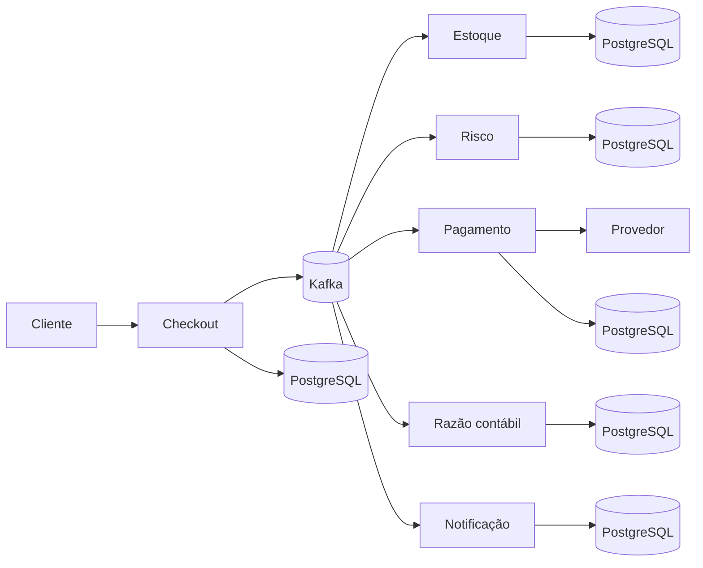

# Orquestra de Pagamentos

[](https://github.com/Mateusmith/orquestra-pagamentos/actions/workflows/integracao-continua.yml)
[](https://openjdk.org/projects/jdk/25/)
[](https://spring.io/projects/spring-boot)
[](https://kafka.apache.org/)
[](https://www.postgresql.org/)
[](LICENSE)

Orquestra de Pagamentos é uma plataforma distribuída de checkout e pagamentos. Ela coordena reserva de estoque, análise de risco, autorização financeira, escrituração contábil e notificação sem depender de uma transação única entre bancos e sem repetir efeitos quando uma mensagem é entregue novamente.

O projeto demonstra problemas que aparecem em sistemas reais: consistência eventual, idempotência, compensação, concorrência, indisponibilidade de terceiros, isolamento entre empresas e rastreamento de uma operação através de vários microsserviços. A política de risco é externa e validada, permitindo ajustar limites e pontuações sem recompilar o serviço.

## O que o sistema resolve

Uma compra não termina quando a API responde `202 Accepted`. A partir desse ponto, uma saga assíncrona garante que:

- o estoque seja reservado antes da cobrança;
- uma compra suspeita seja recusada e tenha o estoque liberado;
- a mesma requisição não gere duas compras nem duas cobranças;
- falhas transitórias no provedor sejam tentadas novamente com limite;
- uma falha contábil após a cobrança cause estorno e liberação do estoque;
- débitos e créditos permaneçam balanceados;
- cada empresa consulte somente os próprios dados;
- cada etapa possa ser investigada por métricas, logs e traces.

## Arquitetura em uma frase

São seis microsserviços Spring Boot ligados por Kafka, cada um proprietário do seu PostgreSQL, usando saga orquestrada, outbox/inbox e operações idempotentes.



## Tecnologias

| Área | Implementação |
|---|---|
| Linguagem e runtime | Java 25 LTS e Virtual Threads |
| Aplicação | Spring Boot 4.1, Spring MVC, JDBC e Flyway |
| Eventos | Apache Kafka, Avro e Apicurio Registry |
| Dados | PostgreSQL isolado por serviço e Redis |
| Resiliência | Resilience4j, retentativas, circuit breaker e DLT |
| Segurança | OAuth2 Resource Server, JWT, Cognito, escopos e multiempresa |
| Observabilidade | OpenTelemetry, Prometheus, Grafana, Tempo, Loki e Alloy |
| Testes | JUnit 5, Testcontainers, Postman e k6 |
| Entrega | Docker Compose, Helm, Kubernetes, EKS, Terraform e GitHub Actions |

## Serviços

| Serviço | Porta | Responsabilidade |
|---|---:|---|
| Checkout | `8080` | Receber a compra, garantir idempotência e orquestrar a saga |
| Estoque | `8081` | Controlar saldo, reserva e liberação concorrente |
| Risco | `8082` | Calcular sinais e pontuação de fraude |
| Pagamento | `8083` | Autorizar, estornar e conciliar transações |
| Razão contábil | `8084` | Registrar partidas dobradas imutáveis |
| Notificação | `8085` | Processar comunicações fora do caminho crítico |
| Simulador de provedor | `8090` | Produzir aprovação, recusa e instabilidade controladas |

## Executar localmente

### Pré-requisitos

- Docker Desktop com Docker Compose;
- Java 25 apenas para compilar ou testar fora dos contêineres;
- PowerShell 7 recomendado no Windows.

### Subir todo o ambiente

```powershell
cd D:\JavaEstudo\portfolio-java\orquestrapay
.\scripts\iniciar.ps1
```

O script compila os módulos, constrói as imagens e aguarda os serviços ficarem saudáveis. Para reutilizar os artefatos já compilados:

```powershell
.\scripts\iniciar.ps1 -SemCompilar
```

Para reutilizar também as imagens existentes, use `-SemConstruirImagens`. Em máquinas com memória limitada, `-SemObservabilidade` mantém apenas a saga e suas dependências. O script inicia o núcleo primeiro e a observabilidade depois para evitar picos desnecessários.

### Verificar e parar

```powershell
.\scripts\status.ps1
.\scripts\parar.ps1
```

## Primeiro teste

Execute o fluxo aprovado com verificação de idempotência, risco, pagamento, contabilidade e notificação:

```powershell
.\scripts\testar-fluxo.ps1
```

Execute também os caminhos de recusa por estoque, risco, pagamento, retentativa e compensação:

```powershell
.\scripts\testar-cenarios.ps1
```

Por fim, execute a bateria adversarial. Ela tenta SQL injection, acesso entre
empresas, conflito de idempotência, excesso de corpo/cabeçalho, chamada ao
provedor sem credencial e procura vazamento do token em banco e logs:

```powershell
.\scripts\testar-seguranca.ps1
```

Depois que a saga estabilizar, compare os registros dos seis bancos, os saldos
reservados, as partidas dobradas e as filas duráveis:

```powershell
.\scripts\auditar-consistencia.ps1
```

Para a varredura dinâmica dos endpoints descritos no OpenAPI, execute o OWASP
ZAP pelo script fixado por digest:

```powershell
.\scripts\testar-dast.ps1
```

## Exemplo de compra

No ambiente local, a autenticação está desligada para facilitar os testes, mas a empresa continua obrigatória no cabeçalho.

```http
POST http://localhost:8080/api/v1/compras
X-Empresa-Id: 10000000-0000-0000-0000-000000000001
Idempotency-Key: pedido-loja-2026-0001
Content-Type: application/json
```

```json
{
  "idCliente": "cliente-001",
  "emailCliente": "cliente@exemplo.com",
  "moeda": "BRL",
  "pais": "BR",
  "identificadorDispositivo": "dispositivo-001",
  "tokenPagamento": "tok_aprovado",
  "itens": [
    {
      "idProduto": "30000000-0000-0000-0000-000000000001",
      "quantidade": 2,
      "precoUnitario": 79.90
    }
  ]
}
```

O retorno inicial é assíncrono. Consulte `GET /api/v1/compras/{idCompra}` até o estado final `CONCLUIDA`, `RECUSADA` ou `COMPENSADA`.

## Acessos locais

| Recurso | Endereço | Credenciais |
|---|---|---|
| Swagger do checkout | http://localhost:8080/swagger-ui.html | sem login local |
| Grafana | http://localhost:3010 | `admin` / `orquestrapay` |
| Prometheus | http://localhost:9090 | sem login local |
| Tempo | http://localhost:3200 | via Grafana |
| Loki | http://localhost:3100 | via Grafana |
| Apicurio Registry | http://localhost:8088 | sem login local |

Os bancos locais usam usuário e senha `orquestrapay`. As portas são `5433` a `5438`, uma para cada serviço, e `5439` para o registro de esquemas. Essas credenciais existem somente para desenvolvimento.

## Postman

Importe os dois arquivos:

- `postman/orquestrapay-fluxo-completo.postman_collection.json`;
- `postman/orquestrapay-ambiente-local.postman_environment.json`.

A coleção prepara o estoque, valida replay idempotente, acompanha a saga, consulta todos os participantes, executa conciliação e provoca falhas controladas.

## Qualidade e testes

```powershell
java --version
.\mvnw.cmd --batch-mode --no-transfer-progress clean verify
docker compose config --quiet
docker compose --profile carga run --rm k6
```

Os testes automatizados cobrem regras de risco, criptografia do token, validação
JWT, simulador de provedor e os repositórios de todos os serviços com
PostgreSQL/Testcontainers. A integração contínua também valida Compose, JSON,
Helm e Terraform, além de executar CodeQL, Semgrep, Gitleaks e Trivy.

## Segurança

O perfil cloud habilita JWT assinado, valida `issuer`, `token_use`, cliente,
escopos e a empresa presente no token. Rotas desconhecidas são negadas por
padrão. O cabeçalho de empresa não pode substituir a identidade autenticada.
Tokens de pagamento são protegidos com AES-256-GCM antes de chegar ao banco;
cada domínio usa uma credencial PostgreSQL própria e segredos são entregues pelo
AWS Secrets Manager com funções IAM separadas no Kubernetes.

Não use as senhas, chaves ou o modo sem autenticação do Compose em produção.

## Documentação

- [Arquitetura](docs/ARQUITETURA.md)
- [Segurança](docs/SEGURANCA.md)
- [Testes](docs/TESTES.md)
- [Operação local](docs/OPERACAO.md)
- [SLOs e alertas](docs/SLOS.md)
- [Implantação de referência na AWS](docs/IMPLANTACAO-AWS.md)
- [Contrato assíncrono](docs/eventos-asyncapi.yml)
- [Decisões arquiteturais](docs/adr)

## Estado da entrega

A versão local implementa o fluxo completo, cenários de falha, segurança configurável, observabilidade, testes e infraestrutura como código. Os recursos AWS estão modelados e validados estaticamente, mas não são provisionados automaticamente para evitar cobrança inesperada.
