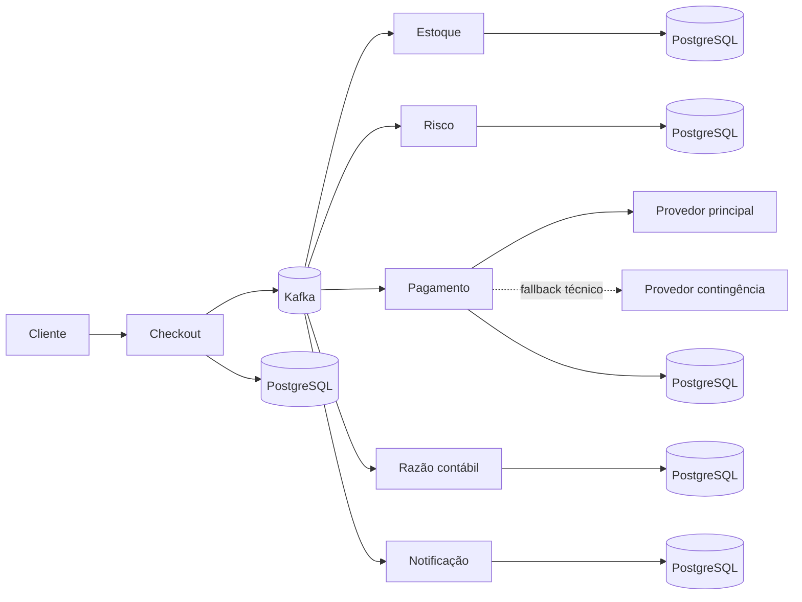

# Orquestra de Pagamentos

[](https://github.com/Mateussoaresferreira/orquestra-pagamentos/actions/workflows/integracao-continua.yml)
[](https://github.com/Mateussoaresferreira/orquestra-pagamentos/tree/v1.0.0)
[](https://openjdk.org/projects/jdk/25/)
[](https://spring.io/projects/spring-boot)
[](https://kafka.apache.org/)
[](https://www.postgresql.org/)
[](https://docs.docker.com/compose/)
[](docs/TESTES.md)
[](LICENSE)

Orquestra de Pagamentos é um backend distribuído que processa uma compra do
checkout à notificação final. A plataforma coordena estoque, risco, pagamento,
contabilidade e comunicação sem depender de uma transação única entre bancos e
sem repetir efeitos financeiros quando requisições ou mensagens são entregues
novamente.

O projeto foi construído para demonstrar decisões encontradas em plataformas
financeiras reais: consistência eventual, idempotência, compensação,
concorrência, indisponibilidade de terceiros, isolamento entre empresas e
rastreamento ponta a ponta. Os provedores são simulados de forma controlada;
nenhum cartão real é armazenado e nenhuma transação financeira verdadeira é
executada.

## Visão rápida

| Pergunta | Resposta |
|---|---|
| O que entra? | Uma compra identificada por empresa e chave de idempotência |
| O que sai? | Compra concluída, recusada ou compensada, com histórico auditável |
| Como os domínios conversam? | Eventos Kafka com Avro, outbox/inbox e chave ordenada por saga |
| Como falhas são tratadas? | Retry limitado, circuit breaker, fallback, quarentena e compensação |
| Como os dados são separados? | Um PostgreSQL e uma credencial por serviço, com isolamento multiempresa |
| Como executar? | Um comando PowerShell sobre Docker Compose |

## O que o sistema resolve

Uma compra não termina quando a API responde `202 Accepted`. A partir desse ponto, uma saga assíncrona garante que:

- o estoque seja reservado antes da cobrança;
- uma compra suspeita seja recusada e tenha o estoque liberado;
- a mesma requisição não gere duas compras nem duas cobranças;
- falhas transitórias no provedor sejam tentadas novamente com limite;
- cartão seja roteado entre provedores com fallback somente em falha técnica;
- PIX seja criado de forma assíncrona e confirmado por webhook HMAC;
- uma falha contábil após a cobrança cause estorno e liberação do estoque;
- débitos e créditos permaneçam balanceados;
- recebíveis parcelados preservem a soma exata da compra;
- divergências de conciliação e mensagens em quarentena possam ser tratadas;
- sistemas clientes recebam webhooks duráveis sem bloquear a saga;
- cada empresa consulte somente os próprios dados;
- cada etapa possa ser investigada por métricas, logs e traces.

## Arquitetura em uma frase

São seis microsserviços Spring Boot ligados por Kafka, cada um proprietário do seu PostgreSQL, usando saga orquestrada, outbox/inbox e operações idempotentes.



## Tecnologias

| Área | Implementação |
|---|---|
| Linguagem e runtime | Java 25 LTS e Virtual Threads |
| Aplicação | Spring Boot 4.1, Spring MVC, JDBC e Flyway |
| Eventos | Apache Kafka, Avro e Apicurio Registry |
| Dados | PostgreSQL isolado por serviço, RDS Proxy e Redis |
| Resiliência | Resilience4j, retry, circuit breaker, bulkhead, cotas Redis e DLT |
| Segurança | OAuth2 Resource Server, JWT, Cognito, escopos e multiempresa |
| Integrações | PIX assíncrono, email SMTP, webhooks HMAC e Spring Boot Starter tipado |
| Observabilidade | OpenTelemetry, Prometheus, Grafana, Tempo, Loki e Alloy |
| Testes | JUnit 5, Testcontainers, Postman e k6 |
| Entrega | Docker Compose, Helm, KEDA, Karpenter, EKS, Terraform e GitHub Actions |

## Serviços

| Serviço | Porta | Responsabilidade |
|---|---:|---|
| Checkout | `8080` | Receber a compra, garantir idempotência e orquestrar a saga |
| Estoque | `8081` | Controlar saldo, reserva e liberação concorrente |
| Risco | `8082` | Calcular sinais e pontuação de fraude |
| Pagamento | `8083` | Rotear cartão/PIX, estornar, receber callbacks e conciliar |
| Razão contábil | `8084` | Registrar partidas dobradas e agenda de recebíveis |
| Notificação | `8085` | Entregar emails SMTP e webhooks empresariais com retry durável |
| Provedor principal | `8090` | Produzir aprovação, PIX, recusa e instabilidade controladas |
| Provedor contingência | `8091` | Comprovar fallback técnico entre adquirentes |
| Receptor de webhooks | `8092` | Registrar callbacks locais no WireMock |

## Evidências da release 1.0.0

| Verificação | Resultado reproduzível |
|---|---|
| Testes Java | 204 testes JUnit/Testcontainers aprovados e regras JaCoCo atendidas |
| Fluxo Postman | 6 execuções isoladas, 304 requisições e 324 asserções sem falha |
| Consistência | Estoque, risco, pagamento, razão, notificações e outboxes comparados entre serviços |
| Interrupção sob carga | 319 compras aceitas, p95 de 315,68 ms, convergência em 87 s e nenhum efeito financeiro duplicado |
| Tempo | Timestamps UTC validados entre resposta HTTP, persistência e ordem da saga |
| Segurança | SQL injection, isolamento multiempresa, JWT, HMAC, SSRF e idempotência exercitados |
| Varreduras | ZAP, Semgrep, Gitleaks e Trivy sem achados altos ou críticos no escopo auditado |

Os comandos e os limites de cada evidência estão descritos em
[Testes](docs/TESTES.md), [Segurança](docs/SEGURANCA.md) e
[Capacidade](docs/CAPACIDADE.md). Os números comprovam esta release no ambiente
local documentado; não representam um milhão de usuários simultâneos.

## Executar localmente

### Pré-requisitos

- Docker Desktop com Docker Compose;
- Java 25 apenas para compilar ou testar fora dos contêineres;
- PowerShell 7 recomendado no Windows.

### Subir todo o ambiente

```powershell
cd orquestra-pagamentos
.\scripts\iniciar.ps1
```

O script compila os módulos, constrói as imagens e aguarda os serviços ficarem saudáveis. Para reutilizar os artefatos já compilados:

```powershell
.\scripts\iniciar.ps1 -SemCompilar
```

Para reutilizar também as imagens existentes, use `-SemConstruirImagens`. Em máquinas com memória limitada, `-SemObservabilidade` mantém apenas a saga e suas dependências. O script inicia o núcleo primeiro e a observabilidade depois para evitar picos desnecessários.

### Verificar e parar

```powershell
.\scripts\status.ps1
.\scripts\parar.ps1
```

## Primeiro teste

Execute o fluxo aprovado com verificação de idempotência, risco, pagamento, contabilidade e notificação:

```powershell
.\scripts\testar-fluxo.ps1
```

Execute também os caminhos de recusa por estoque, risco, pagamento, retentativa e compensação:

```powershell
.\scripts\testar-cenarios.ps1
```

Para comprovar a entrega SMTP real, interromper o servidor de email e validar
retry e recuperação automática sem falso positivo de envio:

```powershell
.\scripts\testar-envio-email-real.ps1
```

Contratos de evento com versão desconhecida são rejeitados antes de alterar o
domínio e seguem para a DLT depois dos retries configurados. O comportamento é
reproduzido por:

```powershell
.\scripts\testar-versao-evento-dlt.ps1
```

Por fim, execute a bateria adversarial. Ela tenta SQL injection, acesso entre
empresas, conflito de idempotência, excesso de corpo/cabeçalho, chamada ao
provedor sem credencial e procura vazamento do token em banco e logs:

```powershell
.\scripts\testar-seguranca.ps1
```

Depois que a saga estabilizar, compare os registros dos seis bancos, os saldos
reservados, as partidas dobradas e as filas duráveis:

```powershell
.\scripts\auditar-consistencia.ps1
.\scripts\auditar-retornos-tempos.ps1
```

A segunda auditoria também confere os dois resultados do motor de risco,
idempotência, isolamento por empresa, recusa e compensação, além da ordem dos
eventos e da igualdade entre os timestamps UTC retornados pelas APIs e os
persistidos nos sete bancos.

Para a varredura dinâmica dos endpoints descritos no OpenAPI, execute o OWASP
ZAP pelo script fixado por digest:

```powershell
.\scripts\testar-dast.ps1
```

## Exemplo de compra

No ambiente local, a autenticação está desligada para facilitar os testes, mas a empresa continua obrigatória no cabeçalho.

```http
POST http://localhost:8080/api/v1/compras
X-Empresa-Id: 10000000-0000-0000-0000-000000000001
Idempotency-Key: pedido-loja-2026-0001
Content-Type: application/json
```

```json
{
  "idCliente": "cliente-001",
  "emailCliente": "cliente@exemplo.com",
  "moeda": "BRL",
  "pais": "BR",
  "identificadorDispositivo": "dispositivo-001",
  "tokenPagamento": "tok_aprovado",
  "metodoPagamento": "CARTAO",
  "parcelas": 3,
  "itens": [
    {
      "idProduto": "30000000-0000-0000-0000-000000000001",
      "quantidade": 2,
      "precoUnitario": 79.90
    }
  ]
}
```

O retorno inicial é assíncrono. Consulte `GET /api/v1/compras/{idCompra}` até o estado final `CONCLUIDA`, `RECUSADA` ou `COMPENSADA`.

Para PIX, envie `"metodoPagamento": "PIX"`, `"parcelas": 1` e omita o
token. A consulta do pagamento retorna `txid`, código copia e cola, QR Code e
expiração enquanto o estado estiver `AGUARDANDO_CONFIRMACAO`; a saga prossegue
somente após um callback assinado e idempotente do provedor.

O ambiente usa uma chave PIX simulada por padrão. Uma chave real pode ser
definida somente no `.env` local pela variável `PIX_CHAVE_RECEBEDOR`; nunca
publique essa informação nem confirme pagamentos de teste por engano.

## Acessos locais

| Recurso | Endereço | Credenciais |
|---|---|---|
| Swagger do checkout | http://localhost:8080/swagger-ui.html | sem login local |
| Grafana | http://localhost:3010 | `admin` / `orquestrapay` |
| Prometheus | http://localhost:9090 | sem login local |
| Tempo | http://localhost:3200 | via Grafana |
| Loki | http://localhost:3100 | via Grafana |
| Apicurio Registry | http://localhost:8088 | sem login local |
| WireMock | http://localhost:8092/__admin/requests | sem login local |
| Mailpit | http://localhost:8025 | sem login local |

Os bancos locais usam usuário e senha `orquestrapay`. As portas são `5433` a `5438`, uma para cada serviço, e `5439` para o registro de esquemas. Essas credenciais existem somente para desenvolvimento.

## Postman

Importe os dois arquivos:

- `postman/orquestrapay-fluxo-completo.postman_collection.json`;
- `postman/orquestrapay-ambiente-local.postman_environment.json`.

A coleção possui 35 requisições organizadas em seis fluxos: preparação,
cartão parcelado aprovado, falhas controladas, fallback entre provedores, PIX
assíncrono e operação/auditoria. Ela também valida idempotência, partidas
dobradas, recebíveis, webhooks, conciliação, quarentena, recusa sem cobrança e
compensação com estorno e devolução do estoque.

Para executar a mesma coleção automaticamente sem gravar a chave local do
provedor no arquivo versionado:

```powershell
.\scripts\testar-postman.ps1
.\scripts\testar-postman-rapido.ps1 -Execucoes 3 -Paralelismo 3
```

O script injeta o segredo do `.env` em um ambiente temporário e o remove ao
final da execução. Na interface do Postman, informe o mesmo segredo somente no
valor local da variável `chaveApiProvedor`; não exporte esse valor.
O segundo comando dispara cópias isoladas da coleção sem abrir a interface,
consolida requisições e asserções e grava os relatórios em
`target/auditoria-postman`.

## Cliente Java para outros sistemas

O módulo `sdk/orquestrapay-spring-boot-starter` oferece auto-configuração e um
cliente tipado para criar/consultar compras, pagamentos e lançamentos. Em uma
aplicação Spring Boot que inclua o artefato, configure:

```yaml
orquestrapay:
  cliente:
    id-empresa: 10000000-0000-0000-0000-000000000001
    url-checkout: http://localhost:8080
    url-pagamento: http://localhost:8083
    url-razao: http://localhost:8084
    tempo-limite: 5s
```

Injete `ClienteOrquestraPay`; um bean opcional `FornecedorTokenAcesso` fornece
o bearer token quando as APIs estiverem protegidas.

## Qualidade e testes

```powershell
java --version
.\mvnw.cmd --batch-mode --no-transfer-progress clean verify
docker compose config --quiet
.\scripts\testar-carga.ps1
.\scripts\testar-carga-distribuida.ps1 -QuantidadeGeradores 2
.\scripts\testar-interrupcao-consumidor.ps1
.\scripts\testar-volume.ps1 -TotalCompras 1000 -TamanhoLote 250 `
  -TaxaAlvo 10 -Usuarios 5 -QuantidadeEmpresas 20 -IdExecucao calibracao-1000
```

Os testes automatizados cobrem regras de risco, criptografia com rotação de
chaves, JWT, roteamento/fallback, webhook HMAC e anti-SSRF, PIX, parcelamento,
watchdog, filas duráveis e os repositórios com PostgreSQL/Testcontainers. A
integração contínua também valida Compose, JSON, Helm e Terraform, além de
executar CodeQL, Semgrep, Gitleaks e Trivy.

O teste de volume comprova uma quantidade acumulada exata, e não milhões de
usuários simultâneos. Ele trabalha em lotes retomáveis, espera a saga convergir e
compara estoque, risco, pagamentos, razão, notificações, outboxes e quarentenas.
O procedimento para calibrar e executar um milhão de compras está em
[Capacidade e escalabilidade](docs/CAPACIDADE.md).

## Segurança

O perfil cloud habilita JWT assinado, valida `issuer`, `token_use` e clientes
permitidos. Usuários humanos usam papéis e tenant somente leitura; o cliente
máquina usa escopos mínimos e tenant fixado no servidor. Rotas desconhecidas são
negadas por padrão. O cabeçalho de empresa não pode substituir a identidade
autenticada, e o ingresso de produção exige HTTPS e AWS WAF.
Tokens de pagamento são protegidos com AES-256-GCM antes de chegar ao banco;
cada domínio usa uma credencial PostgreSQL própria e segredos são entregues pelo
AWS Secrets Manager com funções IAM separadas no Kubernetes.

Não use as senhas, chaves ou o modo sem autenticação do Compose em produção.

## Documentação

- [Arquitetura](docs/ARQUITETURA.md)
- [Segurança](docs/SEGURANCA.md)
- [Testes](docs/TESTES.md)
- [Capacidade e escalabilidade](docs/CAPACIDADE.md)
- [Operação local](docs/OPERACAO.md)
- [Pagamentos e integrações](docs/PAGAMENTOS-E-INTEGRACOES.md)
- [SLOs e alertas](docs/SLOS.md)
- [Implantação de referência na AWS](docs/IMPLANTACAO-AWS.md)
- [Contrato assíncrono](docs/eventos-asyncapi.yml)
- [Decisões arquiteturais](docs/adr)

## Estado da entrega

A release `1.0.0` implementa cartão multi-provedor, PIX assíncrono, parcelamento,
webhooks duráveis, conciliação, quarentena, watchdog de saga, SDK, cenários de
falha, segurança configurável, observabilidade, testes e infraestrutura como
código. A referência AWS inclui admissão em camadas, KEDA por CPU/lag, Karpenter
com interrupção Spot e RDS Proxy com credenciais por domínio. Os recursos estão
modelados e validados estaticamente, mas não são provisionados automaticamente
para evitar cobrança inesperada.

## Evoluções planejadas

O núcleo da plataforma está concluído. As próximas versões podem aprofundar
capacidades que dependem de operação prolongada ou infraestrutura externa:

- [modelos de risco champion/challenger](https://github.com/Mateussoaresferreira/orquestra-pagamentos/issues/1);
- [token vault e HSM/KMS gerenciado](https://github.com/Mateussoaresferreira/orquestra-pagamentos/issues/2);
- [testes automatizados de caos e recuperação](https://github.com/Mateussoaresferreira/orquestra-pagamentos/issues/3);
- [recuperação multi-região](https://github.com/Mateussoaresferreira/orquestra-pagamentos/issues/4).
