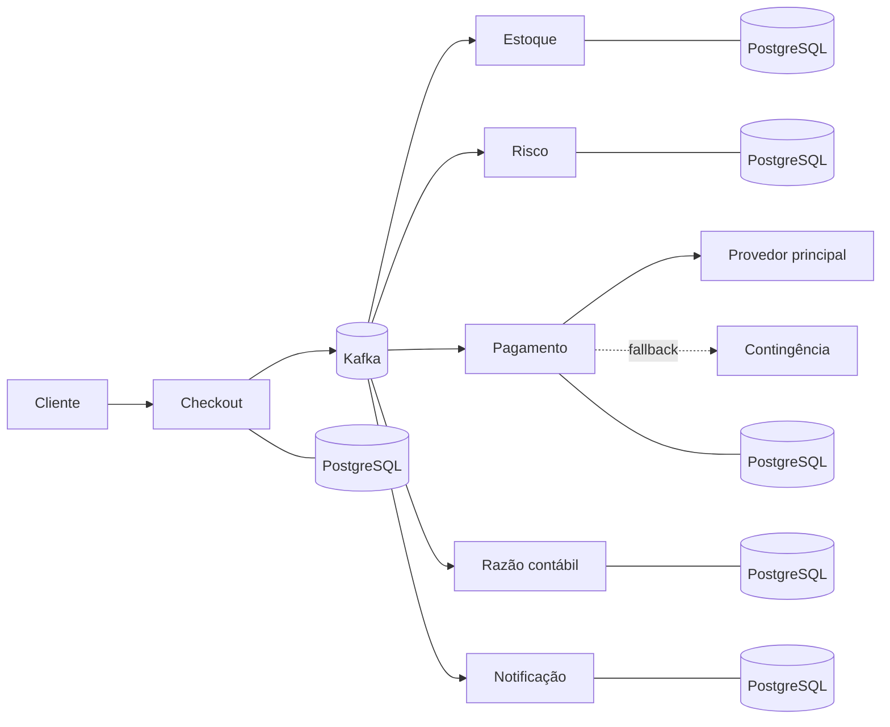

# Orquestra de Pagamentos

[](https://github.com/Mateussoaresferreira/orquestra-pagamentos/actions/workflows/integracao-continua.yml)
[](https://openjdk.org/projects/jdk/25/)
[](https://spring.io/projects/spring-boot)
[](https://kafka.apache.org/)
[](https://www.postgresql.org/)
[](https://docs.docker.com/compose/)
[](LICENSE)

Backend distribuído que conduz uma compra do checkout à notificação final. Seis
microsserviços coordenam estoque, risco, pagamento, contabilidade e comunicação
por eventos, sem transação distribuída e sem repetir efeitos financeiros quando
requisições ou mensagens são entregues novamente.

O projeto demonstra problemas encontrados em plataformas financeiras reais:
consistência eventual, idempotência, concorrência, compensação, indisponibilidade
de terceiros, isolamento multiempresa e rastreamento ponta a ponta.

## O problema

Uma resposta `202 Accepted` apenas inicia o processamento. Depois dela, o sistema
precisa garantir que:

- estoque seja reservado antes da cobrança;
- risco alto interrompa a compra e libere a reserva;
- a mesma requisição não gere duas compras ou cobranças;
- cartão use fallback apenas em falha técnica segura;
- PIX aguarde confirmação assinada e idempotente;
- falha contábil após pagamento provoque compensação;
- débitos, créditos e recebíveis permaneçam consistentes;
- falhas possam ser investigadas e reprocessadas.

## Diferenciais técnicos

| Capacidade | Implementação |
|---|---|
| Consistência distribuída | Saga orquestrada, outbox/inbox e eventos Avro |
| Proteção financeira | Idempotência, partidas dobradas, estorno e conciliação |
| Integrações | Cartão multi-provedor, PIX assíncrono e webhooks HMAC |
| Resiliência | Retry limitado, circuit breaker, bulkhead, fallback e quarentena |
| Segurança | JWT/OAuth2, multiempresa, AES-256-GCM, anti-SSRF e limites Redis |
| Operação | Watchdog, métricas, logs, traces, SLOs e alertas |
| Escala | Virtual Threads, Kafka particionado, KEDA, Karpenter e RDS Proxy |
| Entrega | Docker Compose, Helm, Terraform, GitHub Actions e SDK Java |

## Arquitetura



| Serviço | Porta | Responsabilidade |
|---|---:|---|
| Checkout | `8080` | Idempotência e coordenação da saga |
| Estoque | `8081` | Saldo, reserva e liberação concorrente |
| Risco | `8082` | Sinais e pontuação de fraude |
| Pagamento | `8083` | Cartão, PIX, estorno, webhook e conciliação |
| Razão contábil | `8084` | Partidas dobradas e recebíveis |
| Notificação | `8085` | Email e webhooks empresariais duráveis |

Cada serviço possui seu próprio PostgreSQL. Kafka transporta os fatos da saga;
Redis protege cotas e operações compartilhadas. Provedores, Mailpit, WireMock e a
pilha de observabilidade completam a bancada local.

## Tecnologias

`Java 25` · `Spring Boot 4.1` · `Spring MVC` · `JDBC` · `Flyway` ·
`PostgreSQL 17` · `Kafka 4.1` · `Avro` · `Apicurio Registry` · `Redis` ·
`Resilience4j` · `OAuth2/JWT` · `OpenTelemetry` · `Prometheus` · `Grafana` ·
`Tempo` · `Loki` · `Docker Compose` · `Testcontainers` · `k6` · `Helm` ·
`Terraform` · `AWS EKS/MSK/RDS`.

## Executar localmente

Pré-requisitos: Docker Desktop com Compose e PowerShell 7. Java 25 é necessário
somente para compilar ou testar fora dos contêineres.

```powershell
git clone https://github.com/Mateussoaresferreira/orquestra-pagamentos.git
cd orquestra-pagamentos
.\scripts\iniciar.ps1
.\scripts\status.ps1
```

O primeiro início compila os módulos, constrói as imagens e aguarda a saúde dos
serviços. Em uma máquina com pouca memória, use:

```powershell
.\scripts\iniciar.ps1 -SemObservabilidade
```

Para encerrar sem remover os volumes:

```powershell
.\scripts\parar.ps1
```

O ciclo operacional completo, logs, bancos e limpeza estão em
[Operação local](docs/OPERACAO.md).

## Experimentar a API

Importe no Postman:

- `postman/orquestrapay-fluxo-completo.postman_collection.json`;
- `postman/orquestrapay-ambiente-local.postman_environment.json`.

A coleção contém **37 requisições** distribuídas em preparação, compra aprovada,
falhas controladas, fallback, PIX e auditoria. Execute os fluxos na ordem. Na
requisição `05 - PIX assíncrono > Aguardar cobrança PIX`, a aba `Visualization`
mostra o QR Code, o `txid` e o código PIX Copia e Cola.

Também é possível validar tudo sem abrir o Postman:

```powershell
.\scripts\testar-postman.ps1
.\scripts\auditar-consistencia.ps1
```

> [!WARNING]
> O ambiente usa uma chave PIX fictícia. `PIX_CHAVE_RECEBEDOR` permite configurar
> uma chave somente no `.env` local. Uma chave real torna o QR potencialmente
> pagável, mas o simulador não consulta o banco nem confirma liquidação real.

## Evidências da `main`

| Verificação | Resultado reproduzível |
|---|---|
| Java | 204 testes JUnit/Testcontainers e regras JaCoCo aprovados |
| Postman | 52 chamadas e 55 asserções; bateria paralela com 304 chamadas e 324 asserções, sem falhas |
| Consistência | Seis bancos, estoque, risco, pagamento, razão, filas e outboxes comparados |
| Interrupção | 319 compras aceitas, p95 de 315,68 ms e convergência em 87 s |
| Segurança | SQL injection, multiempresa, JWT, HMAC, SSRF e idempotência exercitados |
| Varreduras | ZAP, Semgrep, Gitleaks e Trivy sem achados altos ou críticos no escopo auditado |

Esses números pertencem à branch `main` no ambiente local documentado. Eles não
significam um milhão de usuários simultâneos. Métodos, relatórios e limites estão
em [Testes](docs/TESTES.md), [Segurança](docs/SEGURANCA.md) e
[Capacidade](docs/CAPACIDADE.md).

## O que é simulado

Os microsserviços, bancos, Kafka, Redis, saga, idempotência, compensação,
conciliação e observabilidade executam de verdade. Adquirentes, liquidação
bancária, SPI e infraestrutura AWS são simulações ou modelos locais. Nenhum
cartão real é armazenado e nenhum saldo bancário é consultado.

## Acessos principais

| Recurso | Endereço |
|---|---|
| Swagger do checkout | http://localhost:8080/swagger-ui.html |
| Grafana | http://localhost:3010 |
| Mailpit | http://localhost:8025 |
| Apicurio Registry | http://localhost:8088 |

Todos os endereços, portas e credenciais de desenvolvimento estão em
[Operação local](docs/OPERACAO.md). Os contratos HTTP versionados ficam em
[`docs/openapi`](docs/openapi), e o contrato de eventos está em
[AsyncAPI](docs/eventos-asyncapi.yml).

## Documentação

O [índice de documentação](docs/INDICE.md) organiza a leitura por objetivo.

| Documento | Assunto |
|---|---|
| [Arquitetura](docs/ARQUITETURA.md) | Saga, consistência, concorrência e decisões de domínio |
| [Pagamentos e integrações](docs/PAGAMENTOS-E-INTEGRACOES.md) | Cartão, PIX, webhooks, conciliação e SDK |
| [Testes](docs/TESTES.md) | Unidade, integração, ponta a ponta, carga e caos |
| [Segurança](docs/SEGURANCA.md) | Identidade, isolamento, criptografia e ameaças |
| [Capacidade](docs/CAPACIDADE.md) | Medições, limites e caminho para escala |
| [Operação](docs/OPERACAO.md) | Ciclo local, diagnóstico, dados e recuperação |
| [AWS](docs/IMPLANTACAO-AWS.md) | Referência EKS/MSK/RDS sem provisionamento automático |
| [ADRs](docs/adr) | Decisões arquiteturais e consequências |

## Estado do projeto

O núcleo está concluído e possui CI, análise de segurança, testes reproduzíveis e
infraestrutura como código. A AWS não é criada automaticamente para evitar
cobrança inesperada.

Evoluções maiores permanecem rastreadas nas issues:

- [modelos de risco champion/challenger](https://github.com/Mateussoaresferreira/orquestra-pagamentos/issues/1);
- [token vault e HSM/KMS gerenciado](https://github.com/Mateussoaresferreira/orquestra-pagamentos/issues/2);
- [testes automatizados de caos e recuperação](https://github.com/Mateussoaresferreira/orquestra-pagamentos/issues/3);
- [recuperação multi-região](https://github.com/Mateussoaresferreira/orquestra-pagamentos/issues/4).

## Licença

Distribuído sob a [licença MIT](LICENSE).
