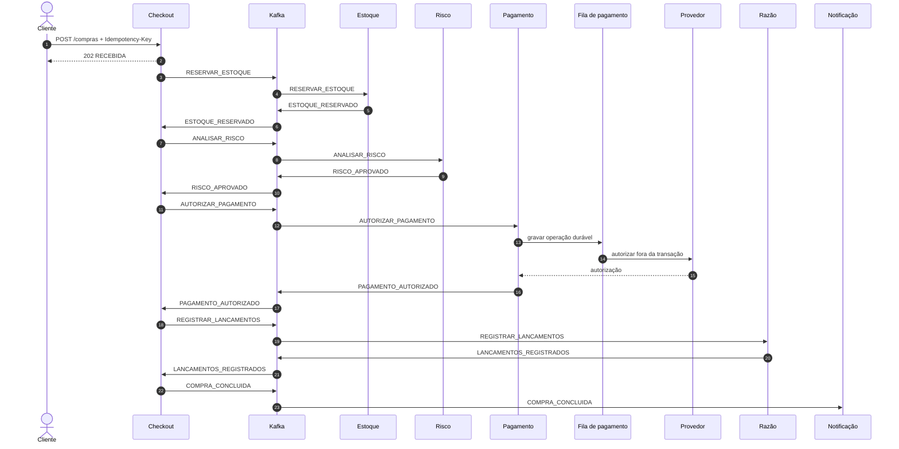
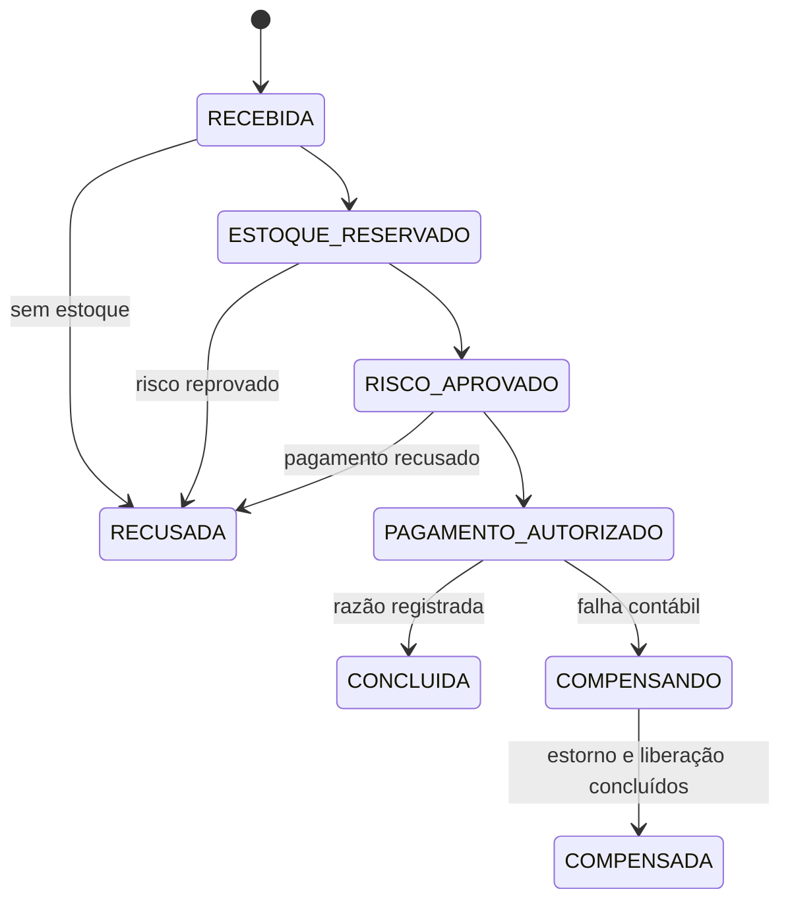

# Arquitetura da Orquestra de Pagamentos

## Contexto

Uma compra atravessa recursos que não compartilham a mesma transação: estoque, risco, pagamento e razão contábil. A Orquestra de Pagamentos não tenta esconder essa realidade com uma transação distribuída. Cada participante confirma sua própria mudança e publica o próximo fato de forma durável.

## Limites de negócio

| Limite | Dados que possui | Decisão principal |
|---|---|---|
| Checkout | compra, itens, idempotência e histórico | qual é a próxima etapa da saga |
| Estoque | saldos, reservas e itens reservados | reservar ou recusar; liberar ao compensar |
| Risco | análises, sinais e pontuação | aprovar ou reprovar uma compra |
| Pagamento | operações, provedores, PIX, callbacks e conciliações | rotear, autorizar, aguardar ou estornar |
| Razão | transações, lançamentos e recebíveis | aceitar partidas balanceadas e agendar parcelas |
| Notificação | mensagens e webhooks empresariais | comunicar o estado final sem bloquear a compra |

Nenhum serviço consulta diretamente as tabelas de outro serviço.

## Política de risco

O motor combina regras independentes de valor, país, velocidade de compras e compartilhamento de dispositivo. O código define como cada sinal é calculado; os parâmetros de negócio ficam em `orquestrapay.risco.politica` e podem ser substituídos por variáveis de ambiente.

São configuráveis os limites monetários, as pontuações, o país de referência, as janelas temporais e a pontuação de reprovação. A aplicação valida toda a política na inicialização e recusa combinações incoerentes, como um limite “muito alto” menor que o limite “alto”. Assim, uma alteração operacional não exige nova compilação, mas uma regra nova continua exigindo código revisado e testes.

### Champion e challenger

O modelo champion é o único que decide o evento `RISCO_APROVADO` ou
`RISCO_REPROVADO`. Depois da confirmação da transação, uma amostra determinística
por `idCompra` também passa pelo challenger. Essa avaliação ocorre em uma nova
transação, persiste versão, sinais, pontuação e divergência, mas nunca altera a
compra nem publica evento de negócio.

Falha do challenger é isolada, medida e alertada. As APIs permitem consultar a
comparação de uma compra e o resumo de até 90 dias por empresa. Não existe
promoção automática: trocar o champion continua sendo uma mudança explícita de
configuração, precedida por revisão da amostra e dos testes.

## Fluxo aprovado

## Compensação

Se a razão contábil falhar depois que o pagamento foi autorizado, o checkout muda para `COMPENSANDO` e solicita duas operações independentes:

1. estornar o pagamento;
2. liberar a reserva de estoque.

A compra só muda para `COMPENSADA` quando as duas confirmações chegam. As confirmações podem chegar em qualquer ordem e podem ser repetidas.

## Pagamentos síncronos e assíncronos

O consumo do evento grava o pagamento e uma operação durável na mesma
transação. Um trabalhador reivindica operações com `SKIP LOCKED`, chama o
provedor fora da transação e persiste o resultado com um token de lease. Isso
evita manter conexão JDBC aberta durante I/O remoto e permite múltiplas
instâncias do serviço.

No cartão, uma falha técnica no provedor principal abre espaço para o provedor
de contingência; uma recusa legítima do emissor é resultado de negócio e não
dispara fallback. Bulkheads isolam chamadas simultâneas e uma cota distribuída
no Redis limita a soma de todas as réplicas por adquirente. No PIX, a criação
retorna `txid`, copia e cola, QR Code e
prazo. O pagamento fica `AGUARDANDO_CONFIRMACAO` até receber callback HMAC
válido, idempotente e dentro da janela temporal. PIX vencido é encerrado por um
trabalhador periódico.

## Parcelamento e razão

O número de parcelas acompanha a compra até a escrituração. A razão distribui
o total em centavos, atribui eventual resto às primeiras parcelas e garante no
banco que a soma da agenda seja igual ao valor da transação. Valor, número e
vencimento são imutáveis; a liquidação é idempotente por referência e deixa
auditoria própria.

## Operação e recuperação

- o watchdog do checkout republica a etapa esperada de sagas inativas;
- eventos que esgotam tentativas entram em quarentena auditável;
- webhooks empresariais possuem lease, HMAC, backoff e falha definitiva;
- emails usam SMTP real, lease e backoff; sucesso só é persistido após aceite do servidor;
- a conciliação registra execuções, divergências e tratamento operacional;
- métricas distinguem provedor escolhido, fallback, cota, saturação, PIX
  expirado e falhas de entrega.

## Garantias de consistência

1. A mesma chave de idempotência e o mesmo corpo retornam a compra existente.
2. A mesma chave com outro corpo retorna conflito e não altera a compra original.
3. O estado de negócio e o evento de saída são gravados na mesma transação local.
4. Todo consumidor registra o evento processado na mesma transação do efeito de negócio.
5. Uma reserva bloqueia os saldos em ordem estável para reduzir deadlocks.
6. Autorizações e estornos usam identificadores estáveis no provedor.
7. Uma transação contábil só fecha quando débitos e créditos possuem o mesmo total.
8. Eventos esgotados seguem para quarentena/DLT em vez de serem ignorados.
9. Chamadas externas nunca permanecem dentro da transação de banco.
10. Callback PIX e webhook empresarial são autenticados e idempotentes.
11. A soma das parcelas sempre coincide com o total contábil.
12. O consumidor rejeita versões desconhecidas antes de iniciar a transação de domínio.

## Outbox e inbox

O produtor não publica diretamente durante a transação de negócio. Ele insere
`evento_saida`; um publicador posterior envia o envelope Avro ao Kafka e marca
a linha como publicada. O repositório reivindica apenas o evento não publicado
mais antigo de cada compra. O publicador mantém os eventos da mesma compra em
sequência, processa compras diferentes em paralelo com concorrência limitada e
confirma o lote enviado em uma única transação local. Isso preserva ordem sem
criar uma transação JDBC por confirmação.

A concorrência permanece explícita e limitada: o checkout publica até 50
compras diferentes em paralelo e os demais domínios até 20. Esses valores podem
ser alterados por ambiente no Compose ou no Helm, sem permitir que Virtual
Threads transformem um backlog em conexões JDBC ou envios Kafka ilimitados.

Uma queda entre envio ao Kafka e confirmação no PostgreSQL pode duplicar a
mensagem, portanto a entrega continua sendo **pelo menos uma vez**.

A [ADR 0005](adr/0005-publicacao-outbox-por-polling.md) mantém o polling nesta
versão e define métricas objetivas para reavaliar CDC com Debezium, sem adicionar
seis conectores antes de existir um gargalo medido.

O consumidor tenta inserir o par evento/consumidor em `evento_processado`. Se ele já existir, encerra sem repetir o efeito. O resultado observado é efetivamente idempotente, sem prometer “exatamente uma vez” entre bancos e broker.

Os comandos e resultados não dividem mais um tópico global. Estoque, risco,
pagamento, razão, notificação e checkout possuem tópicos próprios, além de uma
DLT por domínio. Isso evita que cada consumidor leia e descarte eventos alheios,
permite escalar cada atraso de forma independente e reduz rebalances sem relação
com o serviço afetado.

Cada consumidor declara explicitamente as versões que entende. Uma versão não
suportada falha antes da inbox e do efeito de negócio, passa pelos retries do
listener e termina na DLT do domínio. Isso impede que um payload novo seja
interpretado silenciosamente por código antigo.

## Notificações

O evento final agenda email e webhook na mesma transação da inbox. O email é
reivindicado em lote com `FOR UPDATE SKIP LOCKED`, incremento atômico da
tentativa e token de lease. A conexão SMTP acontece fora da transação JDBC;
somente o trabalhador que ainda possui o lease pode confirmar ou reagendar a
linha. O `Message-ID` deriva do identificador persistido da notificação e
permanece igual em todos os retries.

Como não existe transação distribuída entre PostgreSQL e SMTP, a garantia é
**pelo menos uma vez**. Uma queda depois do aceite remoto e antes da confirmação
local pode duplicar a entrega, porém nunca permite marcar como enviada uma
mensagem recusada pelo transporte.

## Retenção operacional

A inbox é preservada por 90 dias, prazo que precisa permanecer maior que a
retenção do Kafka somada à maior janela de replay operacional. Eventos já
publicados ficam sete dias na outbox. Quarentena e sua auditoria ficam 365 dias,
enquanto chaves HTTP de idempotência ficam 90 dias. Compras, histórico da saga,
lançamentos e demais registros de negócio não são removidos por esse processo.

Cada limpeza usa lotes de até mil linhas e `FOR UPDATE SKIP LOCKED`. Assim,
réplicas concorrentes não disputam o mesmo lote e nenhuma mensagem pendente ou
auditoria ainda retida é removida.

## Ordenação e particionamento

O identificador da compra é a chave Kafka. Todos os eventos da mesma saga permanecem na mesma partição e preservam ordem; compras diferentes podem avançar em paralelo. A sequência no envelope permite detectar anomalias durante a investigação.

## Concorrência

Os serviços usam Spring MVC e JDBC bloqueante sobre Virtual Threads. Essa escolha aumenta a capacidade de esperar por banco, Kafka ou HTTP sem manter uma thread de plataforma por requisição. Pools de conexão, limites do provedor e consultas continuam sendo recursos finitos e precisam de controle próprio.

Existe o perfil `platform-threads` para repetir a mesma carga sem Virtual Threads e comparar p95, memória e concorrência.

## Observabilidade

O cabeçalho W3C `traceparent` entra na API, é salvo na outbox e segue como cabeçalho Kafka. OpenTelemetry coleta traces; Prometheus coleta métricas; Alloy envia logs ao Loki; Grafana correlaciona os sinais.

Métricas de domínio complementam as métricas HTTP:

- `orquestrapay_compras_iniciadas_total`;
- `orquestrapay_compras_concluidas_total`;
- `orquestrapay_compensacoes_iniciadas_total`;
- `orquestrapay_compensacoes_concluidas_total`;
- `orquestrapay_risco_avaliacoes_total`;
- `orquestrapay_risco_comparacoes_total`;
- `orquestrapay_risco_avaliacao_sombra_falhas_total`.

## Execução local e cloud

O Compose oferece dependências autocontidas e segurança desligada para
desenvolvimento. A arquitetura de referência cloud usa EKS, KEDA, Karpenter,
RDS Proxy, RDS PostgreSQL, ElastiCache, MSK Serverless, Cognito, ECR e Secrets
Manager. KEDA escala cada consumidor por CPU e lag do seu tópico; Karpenter cria
capacidade Spot ou sob demanda quando os novos pods não cabem. Os mesmos
serviços mudam apenas por configuração.
