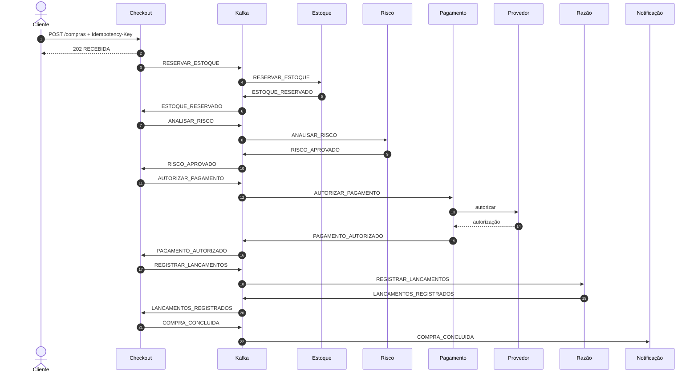
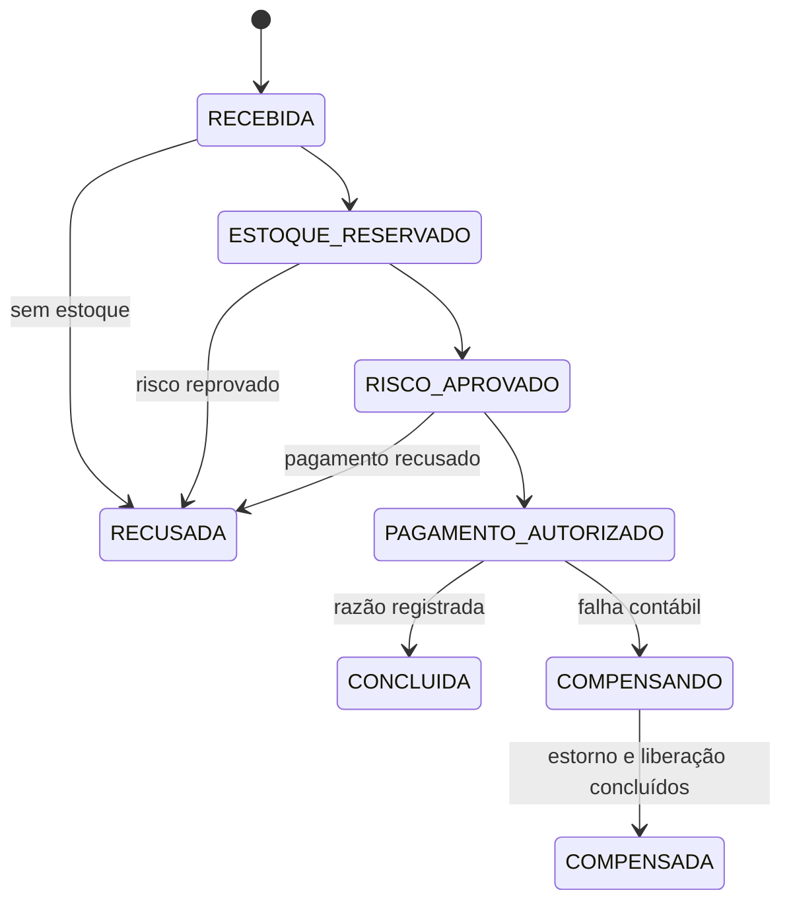

# Arquitetura da Orquestra de Pagamentos

## Contexto

Uma compra atravessa recursos que não compartilham a mesma transação: estoque, risco, pagamento e razão contábil. A Orquestra de Pagamentos não tenta esconder essa realidade com uma transação distribuída. Cada participante confirma sua própria mudança e publica o próximo fato de forma durável.

## Limites de negócio

| Limite | Dados que possui | Decisão principal |
|---|---|---|
| Checkout | compra, itens, idempotência e histórico | qual é a próxima etapa da saga |
| Estoque | saldos, reservas e itens reservados | reservar ou recusar; liberar ao compensar |
| Risco | análises, sinais e pontuação | aprovar ou reprovar uma compra |
| Pagamento | autorizações, estornos e conciliações | autorizar, recusar ou estornar |
| Razão | transações e lançamentos | aceitar somente partidas balanceadas |
| Notificação | fila e tentativas de envio | comunicar o estado final sem bloquear a compra |

Nenhum serviço consulta diretamente as tabelas de outro serviço.

## Política de risco

O motor combina regras independentes de valor, país, velocidade de compras e compartilhamento de dispositivo. O código define como cada sinal é calculado; os parâmetros de negócio ficam em `orquestrapay.risco.politica` e podem ser substituídos por variáveis de ambiente.

São configuráveis os limites monetários, as pontuações, o país de referência, as janelas temporais e a pontuação de reprovação. A aplicação valida toda a política na inicialização e recusa combinações incoerentes, como um limite “muito alto” menor que o limite “alto”. Assim, uma alteração operacional não exige nova compilação, mas uma regra nova continua exigindo código revisado e testes.

## Fluxo aprovado

## Compensação

Se a razão contábil falhar depois que o pagamento foi autorizado, o checkout muda para `COMPENSANDO` e solicita duas operações independentes:

1. estornar o pagamento;
2. liberar a reserva de estoque.

A compra só muda para `COMPENSADA` quando as duas confirmações chegam. As confirmações podem chegar em qualquer ordem e podem ser repetidas.

## Garantias de consistência

1. A mesma chave de idempotência e o mesmo corpo retornam a compra existente.
2. A mesma chave com outro corpo retorna conflito e não altera a compra original.
3. O estado de negócio e o evento de saída são gravados na mesma transação local.
4. Todo consumidor registra o evento processado na mesma transação do efeito de negócio.
5. Uma reserva bloqueia os saldos em ordem estável para reduzir deadlocks.
6. Autorizações e estornos usam identificadores estáveis no provedor.
7. Uma transação contábil só fecha quando débitos e créditos possuem o mesmo total.
8. Eventos esgotados seguem para quarentena/DLT em vez de serem ignorados.

## Outbox e inbox

O produtor não publica diretamente durante a transação de negócio. Ele insere `evento_saida`; um publicador posterior envia o envelope Avro ao Kafka e marca a linha como publicada. Uma queda entre envio e confirmação pode duplicar a mensagem, portanto a entrega é **pelo menos uma vez**.

O consumidor tenta inserir o par evento/consumidor em `evento_processado`. Se ele já existir, encerra sem repetir o efeito. O resultado observado é efetivamente idempotente, sem prometer “exatamente uma vez” entre bancos e broker.

## Ordenação e particionamento

O identificador da compra é a chave Kafka. Todos os eventos da mesma saga permanecem na mesma partição e preservam ordem; compras diferentes podem avançar em paralelo. A sequência no envelope permite detectar anomalias durante a investigação.

## Concorrência

Os serviços usam Spring MVC e JDBC bloqueante sobre Virtual Threads. Essa escolha aumenta a capacidade de esperar por banco, Kafka ou HTTP sem manter uma thread de plataforma por requisição. Pools de conexão, limites do provedor e consultas continuam sendo recursos finitos e precisam de controle próprio.

Existe o perfil `platform-threads` para repetir a mesma carga sem Virtual Threads e comparar p95, memória e concorrência.

## Observabilidade

O cabeçalho W3C `traceparent` entra na API, é salvo na outbox e segue como cabeçalho Kafka. OpenTelemetry coleta traces; Prometheus coleta métricas; Alloy envia logs ao Loki; Grafana correlaciona os sinais.

Métricas de domínio complementam as métricas HTTP:

- `orquestrapay_compras_iniciadas_total`;
- `orquestrapay_compras_concluidas_total`;
- `orquestrapay_compensacoes_iniciadas_total`;
- `orquestrapay_compensacoes_concluidas_total`.

## Execução local e cloud

O Compose oferece dependências autocontidas e segurança desligada para desenvolvimento. A arquitetura de referência cloud usa EKS, RDS, ElastiCache, MSK Serverless, Cognito, ECR e Secrets Manager. Os mesmos serviços mudam apenas por configuração.
